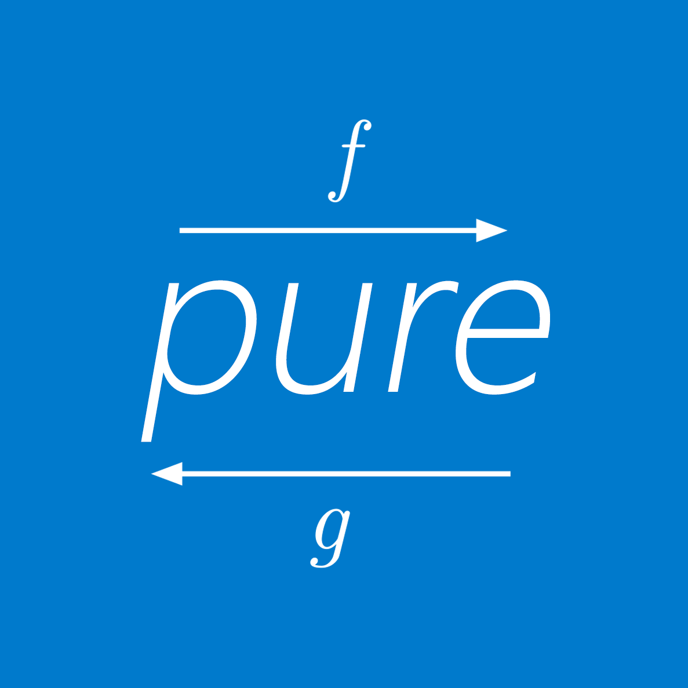

<h3 align="center">
  
</h3

<p align="center">
    <a href="https://travis-ci.org/gigobyte/purify">
      
    </a>
</p>

# What is purify?

Purify is a library for functional programming in TypeScript.
It's purpose is to allow developers to use popular patterns and abstractions that are available in most functional languages.
It is also <a href="https://github.com/fantasyland/fantasy-land">Fantasy Land</a> conformant.

# Core values

- **Elegant and developer-friendly API** - purify's design decisions are made with developer experience in mind. Purify doesn't try to change how you write TypeScript, instead it provides useful tools for making your code easier to read and maintain without resolving to hacks or scary type definitions.

- **Type-safety** - While purify can be used in vanilla JavaScript, it's entirely written with TypeScript and type safety in mind. While TypeScript does a great job at preventing runtime errors, purify goes a step further and provides utility functions for working with native objects like arrays in a type-safe manner.

- **Emphasis on practical code** - Higher-kinded types and other type-level features would be great additions to this library, but as of right now they don't have reasonable implementations in TypeScript. Purify focuses on being a library that you can include in any TypeScript project and favors instance methods instead of functions, clean and readable type definitions instead of advanced type features and a curated API instead of trying to port over another language's standard library.

# How to start?

Purify is available as a package on npm. You can install it with a package manager of your choice:

```
$ npm install purify-ts
```

or

```
$ yarn add purify-ts
```

# Documentation

You can find the documentation on the [official site](https://gigobyte.github.io/purify/).

# Inspired by

- [Haskell](https://haskell-lang.org/)
- [Arrow - Functional companion to Kotlin's Standard Library](http://arrow-kt.io/)
- [fp-ts - Functional programming in TypeScript](https://github.com/gcanti/fp-ts)
- [typical - playground for type-level primitives in TypeScript](https://github.com/tycho01/typical/)
